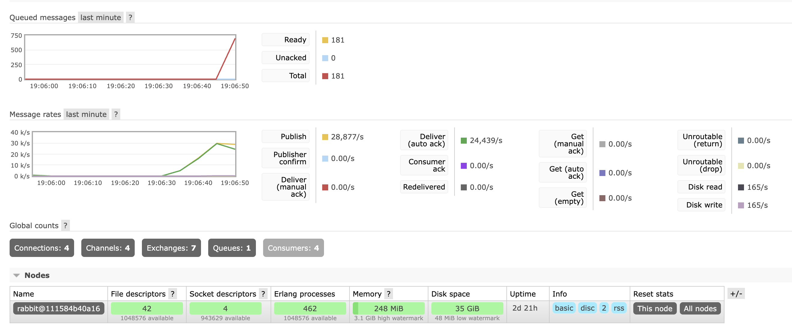
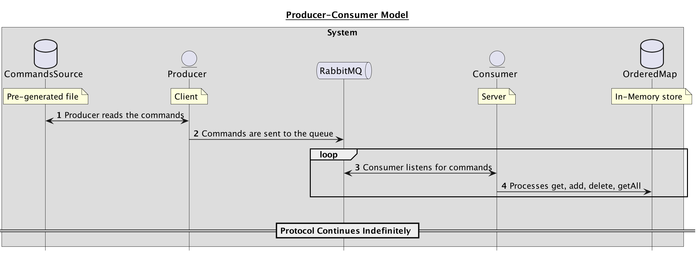

[//]: # (Badges)

[]()
[](https://github.com/zarnoevic)
[](https://github.com/zarnoevic/go-rabbitmq/blob/main/LICENSE.md)
[](https://goreportcard.com/report/github.com/zarnoevic/go-rabbitmq)
[](https://github.com/zarnoevic/go-rabbitmq/actions/workflows/build.yml)
[](https://github.com/zarnoevic/go-rabbitmq/actions/workflows/tests.yml)

# Golang RabbitMQ Server-Client Framework

This is a simple framework for a RabbitMQ server-client communication. 
The server is a consumer service that listens to a queue and processes the messages. 
The client is a producer service that sends messages to the queue.
Each message is of a predefined format and denotes a task over an ordered mapping, whose state is kept, accessed, and updated by the server.

## Results

On a local Macbook Pro with 16GB of RAM and an M1 chip, the processing of 100,000 commands took `4.03` seconds, with both
the client and the server instances running on the same machine, with the settings as provided in the `example.env` file.
This is from the moment the first record is read from the CSV file on the client until the moment the last record is read from the 
RabbitMQ and processed by the server.

The following image demonstrates the snapshot of the state of RabbitMQ during processing.



We notice that the consumption tightly follows the production, with the server processing the messages as soon as they 
are produced by the client, as would be expected in a real-time system.

## Specification

This is a visual (UML) representation of the framework.




## Environment setup

Make your own `.env` file from the `example.env` file.

```shell
cp example.env .env
```

Then modify the `.env` file to your needs. For local testing purposes, the default settings should work just fine.

## Running the Project

The project can be run in two ways: with docker-compose or directly on your machine.
A separate docker-compose file is provided for each service, as well as a dockerfile for each service.
This allows for a scalable deployment of the services, as they can be run in parallel and independently of each other, on different instances.

### Running RabbitMQ

Run the following command to start the service:

```shell
docker-compose -f rabbitClient.docker-compose.yaml --env-file .env up -d
```

### Running the Client

Run the following command to start the Client on your machine:

```shell
go run src/cmd/client/main.go
```

#### With Docker

```shell
docker build -t client -f client.Dockerfile .
docker run --network="host" --env-file .env client
```

#### Scaling the Client

Run the following command to start the Server in a scalable way with docker compose:

```shell
docker-compose -f client.docker-compose.yaml --env-file .env up -d --scale client=4
```

Change the `--scale client=4` parameter to any number of clients you'd want to run in parallel.

### Running the Server

Run the following command to start the Server on your machine:

#### Without Docker

```shell
go run src/cmd/server/main.go
```

#### With Docker

```shell
docker build -t server -f server.Dockerfile .
docker run --network="host" --env-file .env server
```

#### Scaling the Server

Run the following command to start the Server in a scalable way with docker compose:

```shell
docker-compose -f server.docker-compose.yaml --env-file .env up -d --scale server=4
```

Change the `--scale server=4` parameter to any number of clients you'd want to run in parallel.

## Testing

The project is tested with the `go test` command.
    
```shell
go test ./...
```

## Running GitHub Actions Locally

The project is built and tested with GitHub Actions. To run the tests locally, you can use the `act` command.

If you do not have `act` installed, you can install it with the following command on MacOS using Homebrew:

```shell
brew install act
```

Then, you can run the tests with the following command:

```shell
act -n --container-architecture linux/amd64
```

## File structure

A snapshot of the file structure is provided below using the `tree` command for quick reference.

```
.
├── .env
├── go.mod
├── go.sum
├── client.Dockerfile
├── client.docker-compose.yaml
├── rabbitmq.docker-compose.yaml
├── server.Dockerfile
├── server.docker-compose.yaml
├── resources
│   ├── commands100.csv
│   ├── commands100k.csv
│   ├── commands10k.csv
│   └── commands1k.csv
└── src
    ├── cmd
    │   ├── client
    │   │   └── main.go
    │   └── server
    │       └── main.go
    └── pkg
        ├── orderedmap
        │   ├── orderedmap.go
        │   └── orderedmap_test.go
        ├── rabbitClient
        │   └── rabbitClient.go
        └── services
            ├── consumerService
            │   └── consumerService.go
            └── producerService
                └── producerService.go
```
